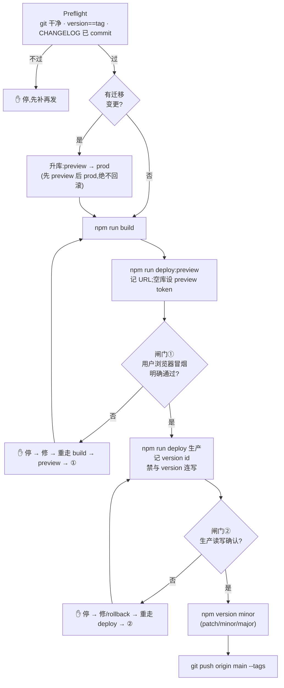

# Release（词库学习岛生产发布）

## 核心原则

顺序不可逆:**升库 → deploy → 浏览器冒烟(硬闸门)→ 通过后才 `npm version` → push**。
闸门未被用户明示「通过」= 停在原地。折叠闸门 = 违反原则。

### 流程总览（闸门决策）



## 铁律(全命令遵守)

- 每个 wrangler 命令**必带 `--config wrangler.toml`**,否则构建产物 `dist/jazz_life_tracker/wrangler.json` 劫持配置 → env 失效、DB 落生产库。
- **禁止新增 `[env.production]`**(wrangler env 派生独立 worker,脱域名/数据)。生产 = 顶层默认 env。
- **禁止 Dashboard 手改 Variables**(rollback 不恢复变量 → 旧代码读新变量白屏)。
- **禁止覆盖 prod `ADMIN_TOKEN`**:secret 已存在,`wrangler secret put` 同名即覆盖 → 全部已存 cookie 失效。preview 用独立新随机值。
- **绝不回滚迁移文件**;部署/冒烟失败**绝不 `npm version`**(孤儿 tag)。
- 本机网络连不上 `.workers.dev` → 冒烟只能等用户浏览器(或自定义域名),curl 返回**不能**代替闸门。

## 流水线(每步 STOP,过闸才走下一步)

1. **Preflight**:`git status` 干净;`package.json` version == 最近 tag(`git tag | tail`);`CHANGELOG.md` 已更新并 commit。任一不过 → 先处理,不上线。
2. **升库(仅当有迁移变更)**:先 preview 后 prod:
   ```bash
   npx wrangler d1 migrations apply --config wrangler.toml jazz-life-tracker-preview --env preview --remote
   npx wrangler d1 migrations apply --config wrangler.toml jazz-life-tracker --remote
   ```
3. `npm run build`
4. `npm run deploy:preview` → 记下 preview URL。preview 空库若无 token,生成随机 token 写入并告知用户冒烟用:
   ```bash
   printf 'jazz-preview-%s\n' "$(openssl rand -hex 16)" | npx wrangler secret put ADMIN_TOKEN --config wrangler.toml --env preview
   ```
5. **闸门①**:给用户 preview URL + 冒烟 5 步(登录 → 词1 三技能结算 +110 → 解锁词2 → 关拼音词2 只 2 步 → 刷新持久)。**等用户明确「通过」**。不因 preview==prod、时间紧、用户催就跳过。
6. `npm run deploy`(生产)→ 记录输出 version id。**禁止与 `npm version`/tag 连写**。
7. **闸门②**:给用户生产 URL,确认核心读写。**不折叠**:preview 通过 ≠ 生产闸门通过。
8. 两闸门通过后:`npm version minor -m "chore(release): v%s"`(bug=patch / 新能力=minor / 破坏=1.0.0 起 major)。
9. `git push origin main --tags`。

## 出错/回滚分支

- 代码/前端错:`npx wrangler rollback --config wrangler.toml`(<10s,前后端同切)。
- env 错:改配置重新 deploy 固化,禁 Dashboard。数据坏:hotfix 改代码或 SQL 修复,绝不回退迁移。
- 冒烟发现问题:停 → 报用户现象 → systematic-debugging 定位修 → 从步骤 3-6 重走,绝不直接 version。

## Red Flags —— 任一出现即停,回读本 skill

- 想「预览过了,生产免测直接打 tag」
- 想 deploy 后一条龙 `&& npm version && git push`
- 想用 curl/接口返回代替用户浏览器冒烟
- 想对 prod `secret put` / 改 Dashboard / 跳过 `--config`
- 用户催「别磨蹭直接发」而自己开始省略闸门

**Rationalization 表**

| 合理化 | 现实 |
| --- | --- |
| 预览==生产,不用重复验 | 生产闸门独立;折叠 = 发布未经最终确认 |
| 老流程熟,不用逐条查 | 坑(配置劫持/secret/迁移序)随配置漂移,每命令都查 `--config` |
| 冒烟通过了,直接 version | 顺序铁律:version 在 deploy+两闸门**之后**;失败冒烟后打 tag = 孤儿 tag |
| preview 就是给预览用的,跳过即可 | preview 闸门先于生产 deploy,前置风险早暴露,省生产回滚 |

## When NOT to Use

- 只改本地代码未到上线(无发布意图) → 不触发。
- 用户仅要回滚/排查但不想走发布 → 读「出错/回滚分支」即可,不强行走全流水线。
